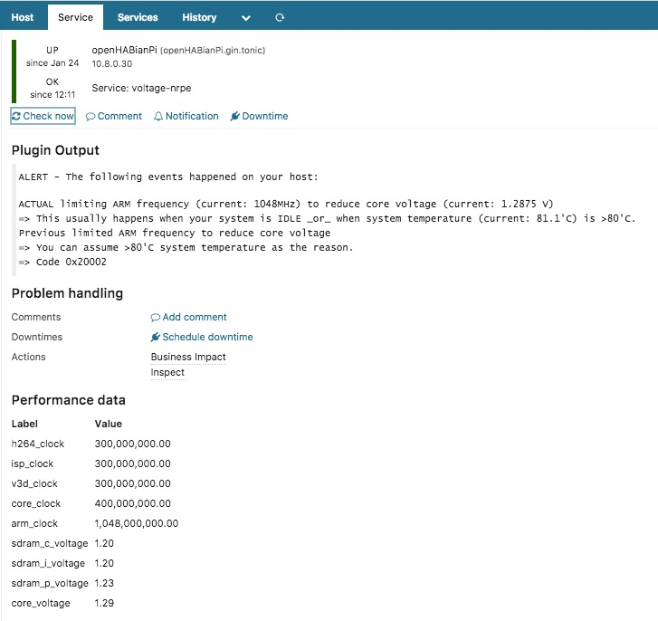
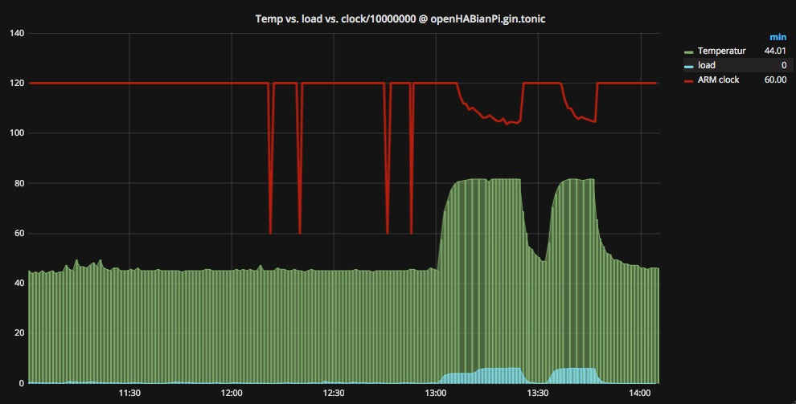

*This repository is archived.*

# icinga2-plugin-raspberrypi_voltage
Measuring voltage values and check whether
* host *is currently*  throttled or not and
* host *was previously* throttled or not
 
It is tested on Raspberry Pi Models: 1, 2 & 3, and I didn't encounter any problems so far.
It is experimental, so use it at your own risk and don't stop thinking when using ;) 
Drop me a note when you run into problems.
**Status worksforme** :)

It was not that easy to get information about the hexcodes and their meaning; essentially, my only resource was [this forum posting](https://www.raspberrypi.org/forums/viewtopic.php?f=63&t=147781&start=50#p972790). Actual states are only shown when they *currently* happen, previously states remain until system reboot - that's why I don't treat previously happened events as `CRITICAL`. The command `vcgencmd get_throttled 0x7` should reset the previously states, but in fact, it doesn't work for me. When you have further information on this - please let me know!

### Usage
```
$ ./check_raspberrypi_voltage
```

### Example
```
$ ./check_raspberrypi_voltage
ALERT - The following events happened on your host:
Previous limited ARM frequency to reduce core voltage
=> You can assume >80'C system temperature as the reason.
=> Code 0x20000
|core_voltage=1.2000;;;; sdram_c_voltage=1.2000;;;; sdram_i_voltage=1.2000;;;; sdram_p_voltage=1.2250;;;; arm_clock=600000000;;;; core_clock=250000000;;;; h264_clock=250000000;;;; isp_clock=250000000;;;; v3d_clock=249999000;;;;
``` 

### Screenshot
This is output in Icinga Web 2.


Process your performance data and create cool Grafana dashboards.



